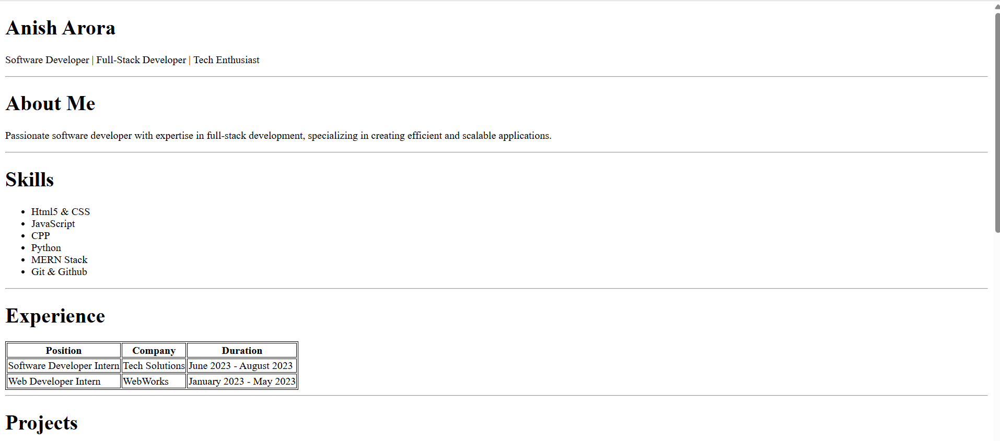

###Project Setup Instructions
1. Clone the Repository:
   ```bash
   git clone <repository_url>
   cd <repository_directory>
   ```
2. Open the Project:
   Open the `ResumePage/index.html` file in your preferred web browser to view the resume page. 
3. Edit the Resume:
   Use any text editor or IDE to modify the `index.html` file located in the `
ResumePage` directory.
4. Save Changes:
   After making edits, save the `index.html` file and refresh your web browser to see the updates.
###Resume Page Overview
The resume page is structured using HTML and includes sections for About Me, Skills, Experience, Education, and Contact Information. Each section is clearly defined with headings and formatted content for easy readability.
File: ResumePage/index.html
--- a/file:///c%3A/Users/sande/OneDrive/Desktop/Cohort2026/ResumePage/index.html
+++ b/file:///c%3A/Users/sande/OneDrive/Desktop/Cohort2026/ResumePage/index.html
@@ -107,6 +107,16 @@

